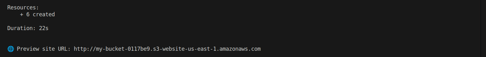

# Pulumi Preview Environment Deployer 🚀

This project automatically deploys **preview environments** to AWS S3 when a pull request is opened, and **destroys them** when the PR is closed — all using Pulumi's Automation API and GitHub webhooks.

## ✨ Features

- Automatic deployment on PR open
- Auto-destroy on PR close
- Uses Pulumi's Automation API with Node.js
- Static site hosted via AWS S3

## 📸 Demo

### Pull request opened (or reopened) on github


### Event received by the nodejs server


### Preview deployment start automatically for the PR


### Preview deployment finish and output preview site url



### Preview deployment accessible in the browser


## 🛠 Tech Stack

- Pulumi (TypeScript)
- Node.js (Express + Automation API)
- AWS S3
- GitHub Webhooks
- ngrok (for local testing)

## 🚀 How It Works

1. A webhook listener receives GitHub PR events.
2. On PR open, Pulumi deploys a static website using the PR number as the stack name.
3. On PR close, the stack is destroyed.
4. Each preview environment is isolated by PR.

## 🧪 Setup & Run

### 1. Clone the repo

```bash
git clone https://github.com/vivienogoun/pulumi-preview-deployer
cd pulumi-preview-deployer
```

### 2. Setup Pulumi

```bash
cd infra
npm install
pulumi login
pulumi config set aws:region <your-aws-region>
```

### 3. Setup the webhook server

```bash
cd ../server
npm install
npx ts-node index.ts
```

### 4. Expose with ngrok

```bash
ngrok http 3000
```

### 5. Add a webhook to your GitHub repo

- Payload URL: `https://<your-ngrok-url>/webhook`
- Content type: `application/json`
- Events: Just the pull request

### 6. Open a PR on your repo and watch the magic happen!

## 💡 Future Improvements

- Deploy dynamic apps instead of static HTML
- Add GitHub App support
- Use Pulumi Cloud or GitHub Actions for CI

## 📄 License

MIT
